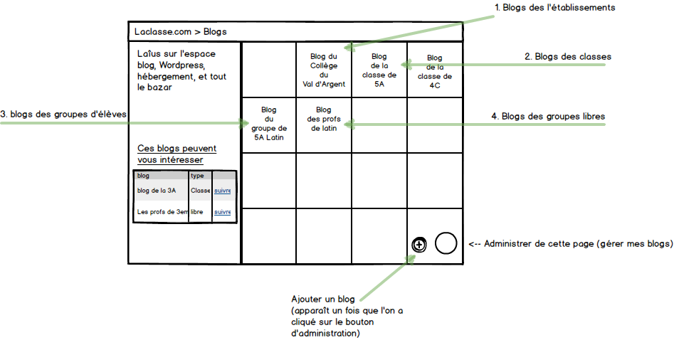
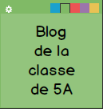

# Intégration de la plateforme de blogs à Laclasse.com V3.
# Spécifications fonctionnelles

## Introduction

Le module de Pilotage de la plateforme de blogs est un composant de l'ancienne version de laclasse.com. 
Ce composant ne sera pas ré-écrit, car il est fonctionnel et stable.
Le travail consistera à concevoir et coder une interface IHM qui sera le front-end d'intégration dans le portail V3, de la plateforme de blog.

## Description fonctionnelle

La plateforme de blogs se base sur WordPress, qu'un plugin spécifique permet de piloter depuis l'ENT, tant en termes de provisinning des comptes, que de création, suppression de blogs, ainsi que de recherche d'existence de blogs ou d'utilisateurs. Ce plugin effectue aussi du pré-paramétrage de la plateforme WordPress (ajout ou blocage de fonctionnalités, SSO CAS, etc...).

Il existe 2 types de blogs :
* blogs d'établissement
* blogs de regroupement (classe, groupe d'élève, groupe libre)

Une fois connecté sur laclasse.com l'utilisateur peut (en fonction de son profil et de ses droits) :
* consulter la liste des blogs auxquels il participe,
* gérer sa participation à un blog,
  * souscrire,
  * se désinscrire.
* créer un blog,
* supprimer un blog existant.

### Points d'entrée par type de profil

Le plugin de pilotage de WordPress, fait le mapping entre les profils Laclasse.com et les profils définis dans WordPress en appliquant des règles fonctionnelles adaptées au métier des collèges.

#### ADMIN
Devient *super-administreur* de tout les blogs, pas de création de blog.

#### PROF, ADM_ETB, CPE, PRINCIPAL
Deviennent *administrateur* de leur sous-domaine s'il n'existe pas, avec création de blog, sinon devient *éditeur* du blog lié au sous-domaine existant.

#### PRINCIPAL
Si le blog est celui de son établissement : Devient *administrateur* de son sous-domaine.
Pour tous les autres blogs, voir la règle ci dessus (profs, cpe, adm_etb).

#### ELEVE
Devient *contributeur* du blog existant, pas de création de blog.

#### PARENT
Devient *souscripteur* du blog existant, pas de création de blog.

### Création d'un blog
Seuls les profils PROF, ADM_ETB, CPE, PRINCIPAL peuvent créer un blog.
Pour créer un blog il faut définir :
* son titre,
* son type :
  - ETB : BLogs d'établissement ( page d'établissement).
  - CLS : Blogs de classes.
  - GRP : Blogs de groupe d'élèves
  - GPL : Blogs de groupes de Groupe libres.
* son nom de sous-domaine : [sous-domaine].blogs.laclasse.com

Le tableau ci-dessous répertorie quel profil peut créer quel type de blog, sachant que seul le super-administrateur travaille sur la totalité des établissements de l'ENT. Les autres profils, lorsqu'ils possèdent les droits de création, ne l'ont que sur le périmètre de leur(s) établissement(s) de rattachement.

| Profil \ type de blog | ETB | CLS | GRP | GPL | 
|-----------------------|-----|-----|-----|-----|
| SUPERADMIN | x | x | x | x |
| ADMIN ETAB | x | x | x | x |
| PRINCIPAL | x | x | x | x |
| PROF |   | x | x | x |
| CPE |   | x | x | x |
| ELEVE |   |   |   |   |
| PARENT |   |   |   |   |

 
### Liste des blogs de l'utilisateur
Un moteur de recherche permet à l'utilisateur de retrouver des blogs dans la liste des blogs.
Selon les profils le périmètre de recherche sera différent.
Le tableau suivant récapitule le périmetre du moteur de recherche des blogs selon le type de blog et le profil utilisateur.
Trois critères sont définis :
 - *Tous* : tous les blogs de ce type sans restriction par établissement
 - *Etablissement* : tous les blogs dépendant des établissements de l'utilisateur, sans restrictions par rapport à ses rattachements de classes et de groupes.
 - *Les siens* : Les blogs dépendants des rattachements (classes, groupes) de l'utilisateur, et donc de son(ses) établissement(s) de rattachement.

| Profil \ type de blog | ETB | CLS | GRP | GPL | 
|-----------------------|-----|-----|-----|-----|
| SUPERADMIN | Tous | Tous | Tous | Tous |
| ADMIN ETAB | Etablissement | Etablissement | Etablissement | Tous |
| PRINCIPAL | Etablissement | Etablissement | Etablissement | Tous |
| PROF | Etablissement | Les siens | Les siens | Tous |
| CPE | Etablissement | Les siens | Les siens | Tous |
| ELEVE | Etablissement | Les siens | Les siens | Tous |
| PARENT | Etablissement | Les siens | Les siens | Tous |

### Désinscription d'un blog
L'utilisateur peut se désinscrire d'un blog auquel il est inscrit. Cette désinscription entraîne la suppression de son profil WordPress pour le blog concerné, mais pas la suppression de son compte WordPress. Il peut, en effet, rester rattéché à d'autres blogs.

### Suppression d'un blog
Seul l'utilisateur "Administrator" (en temps que profil WordPress) du blog ou un utilisateur Super Admin peut supprimer un blog.

1. L'utilisateur loggué possédant les prérequis ouvre l'application Blogs,
2. il passe en mode modification en cliquant l'icône flottante,
3. il retourne la case du blog qu'il souhaite supprimer et clique le bouton correspondant à l'action de suppression.

### Créer un blog
Cette action se fait en cliquant sur le bouton flottant "administrer ma page" puis en cliquant sur un deuxième bouton flottant "+", apparu lors de la première action.

l'affichage du formulaire se fait alors dans une popup modal AngularJS.

Le formulaire affiche dans l'ordre les champs suivants :
- titre (champ texte, obligatoire),
- type de blog  (champ selectbox, obligatoire)
- sous-domaine (champ texte, obligatoire)

Tant que le nom de sous-domaine n'est pas valide, le formulaire de création ne peut être envoyé.

Le champ sous-domaine sera lié avec un service de recherche des sous-domaines existants sur la plateforme de blog. Ce service affichera de qui existe déjà et fera des propositions sur sous-domaines nouveaux, sur la base des critères suivants :
 - Si le type de blog est "Etablissement"
 	- *[nom de l'établissement]*.blogs.laclasse.com
 - Si le type de blog est "Classe" : 
 	- *[nom de la classe]*.blogs.laclasse.com
	- *[nom de la classe]-[année scolaire]*.blogs.laclasse.com
 - Si le type de blog est "Groupe d'élèves" : 
 	- *[nom du groupe]*.blogs.laclasse.com
	- *[nom du groupe]-[année scolaire]*.blogs.laclasse.com

*Attention !*, les noms de sous-domaine proposé doivent respecter les conditions suivantes :
	- que des minuscules
	- pas de caractères accentués
	- caractères autorisés [a-z][0-9][-]
	- Pas de point '.', ni autres caractères spéciaux, à part '-'.

## Interface

L'application reprend le principe du damier des applications du portail de laclasse.com :
* un carré par blog accessible par l'utilisateur affiché sur un damier de 4✕4
* s'il y a plus de 16 blogs à afficher la liste défile verticalement
* l'utilisateur peut filtrer par type de blog, par nom.
* L'ajout, la modification et la suppression se fait en passant en mode « modification » en cliquant sur une icône ronde en surimpression (même mode que le mode de paramétrage du portail v3). 
Dans ce mode « modification » les cases sont retournables et une fois retrounées, elles permettent les actions suivantes :
    - Edition le nom du blog, 
    - Paramétrage de la couleur de la case.
    - Désinscription d'un blog
   
* Les cases sont arrangeables; 
* les cases sont supprimables ce qui entraine la désinscription de l'utilisateur au blog.
* La suppression d'un blog se fait avec un bouton "supprimer" sur l'envers de la case qui n'est affiché que si l'utilisateur a les droits reequis pour supprimer un blog. 
* La création de blog se fait dans une popup (similaire à l'ajout d'application au portail.)

Sur la partie gauche de l'écran, un algorithme de suggestion permettra de faire une liste d'au maximum 5 blogs succeptibles d'intéresser l'utilisateur. Ceci ne concerne que les blogs auquels il ne serait pas rattaché. Il est possible que l'algorithme de suggestion ne retourne rien, si l'utilisateur est rattaché à tout ce qui peut le concerner. 

Les critères sont les suivants :
- Blog de ses établissements (tous les profils sont concernés)
- Blog de classes et groupes d'élèves (profils profs, principaux, cpe, élèves, parents)
- blog de groupes libres ? un au hasard ? 
- Blogs de projets estampillés Erasme (certains blogs marqué par les Admins de la métropole, sur des projets particuliers)

Le passage en mode" gestion de la page" passe tous les carrés en mode administration (comme sur le portail).
Cela permet de gérer la couleur et l'ordre d'affichage.

Un clic sur le picto "paramétrage" fait basculer le carré de sorte qu'il présent son envers. Ce nouvel affichage permet de présenter les fonctions de désinscription, de suppression du blog (si les droits l'autorise), et de récupération de l'url du flux rss du blog (cela permet d'ajouter ce flux rss dans le lecteur rss de la page d'accueil).

## Cadre technique

### Développements

#### Serveur

  - Sinatra
  - Ruby

#### Backend

  - Toutes les données nécessaires à cette application seront stockées dans l'annuaire.

#### Client

  - Angular JS
  - Éléments mutualisés de laclasse.com
  
## Annexes
### Documentation sur le fonctionnement du plugin de pilotage et provisionning de WordPress

