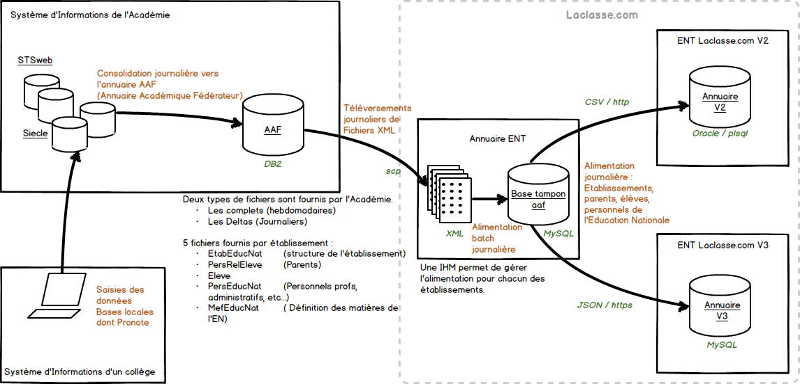
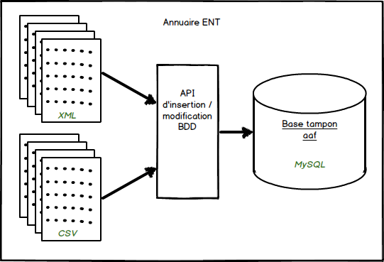
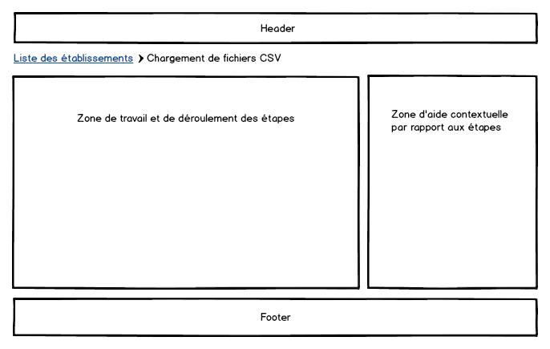

# Spécifications fonctionnelles 
# Intégration de l'import CSV des élèves et des profs dans l'annuaire ENT.

## objectif et contours fonctionnels
L'annuaire ENT est le service qui réaliser l'analyse et l'importation des comptes fournis par le système d'informations de l'académie de LYON. Elle réceptionne les donnéess poussées par l'académie tout les jours, parse le XML et consolide une base tampon de comptes d'élèves, de parents et de personnels de l'éducation nationale. Cette base alimente ensuite à la demande (manuellement ou automatiquement les ENT v2 et V3, selon le choix de chaque établissement).

### Schéma général de fonctionement



L'objectif est de développer une interface permettant le chagement et le traitement de fichiers CSV pour la création de comptes d'élèves et de profs dans les écoles primaires.
Le fichiers demandé aux administrateurs et à destination de l'annuaire ENT est issu du système d'information académique via une extraction au format CSV de l'application BASE_ELEVES.

Cette interface est branchée au plus haut niveau de gestion des comptes, l'annuaire ENT, qui ensuite dispatche les comptes dans les 2 versions de l'ENT V2 et V3.

*Le traitement prendra en entrée les données des fichiers CSV et les transformera dans les formats utilisées par les api d'insertion/modification de base de données qui sont déjà alimentée par l'analyse des fichiers XML.* Cette partie est spécifiée plus bas dans ce document.



Les développements devront s'intégrer dans l'existant, en utilisant au maximum les fonctions, commandes et classes existantes. Il n'est pas demandé dans ce travail de refactorer l'ensemble de l'application, néanmoins des propositions de refactoring pourront être faites en fin de projet.

## L'existant
L'interface web de l'annuaire ENT est existante. Il faut donc intégrer la fonctionnalité CSV dans l'existant.
L'enchaînement des écrans est aussi déjà intégré, mais nécessitera d'être revue afin d'évoluer avec les developpements demandé. Aucun traitement n'a encore été ecrit, l'existant ne représente donc qu'une maquette d'enchaînement des écrans.

## Structure du fichier issu de BASE_ELEVES
### Le fichier ELEVES
L'extraction CSV de BASE_ELEVES contient les champs suivants :

- Nom Elève
- Nom d'usage Elève
- Prénom Elève
- Date naissance
- Sexe
- Adresse1
- Cp1
- Commune1
- Pays1
- Adresse2
- Cp2
- Commune2
- Pays2
- Cycle         (Il s'agit du cycle d'apprentissage : cycle II, ou III)
- Niveau        (On trouve dans ce champs le niveau de la classe CP, CE1 , CE2, CM1 , CM2)
- Classe        (On trouve ici la typologie de classe : "01 COURS PREPARATOIRE-COURS ELEMENTAIRE 1", "02 COURS ELEMENTAIRE 1 ET 2", "03 COURS ELEMENTAIRE 2 COURS MOYEN 1", "04 COURS MOYEN 1 ET 2")
- Attestation fournie         (Oui/Non)
- Autorisations associations  (Oui/Non)
- Autorisations photos        (Oui/Non)
- Décision de passage         (Oui/Non)

Les quatres derniers champs fournis ne sont pas utilisés par le processus d'alimention à mettre en place.

### Le fichiers des parents
La structure du fichiers des parents est plus complexe puisque la relation 1-n parents <-> enfants est mise à plat dans le fichier.
Cela signifie que la séquences des derniers champs peut se répéter autant de fois sur la même ligne qu'il y a d'enfants. Ce fichier a donc une structure variable.

- Civilité Responsable    (3 valeurs possibles : M., MME, MLLE)
- Nom usage responsable
- Nom responsable
- Prénom responsable
- Adresse responsable
- CP responsable
- Commune responsable
- Pays
- Courriel
- Téléphone domicile
- Téléphone travail
- Numéro de poste
- Téléphone portable
Puis les 4 champs répétés autant de fois que d'enfants dans l'école.
- Nom d'usage enfant
- Nom de famille enfant
- Prénom enfant
- Classes enfants

### Le fichiers PROFS

## Structure de l'annuaire ENT
### l'UID unique
A chaque utilisateur est affecté un uid unique normé par l'annexe du SDET concernant l'annuaire ENT. Une fonction php permet de récupérer un UID en fonction de certains paramètres.

### Règles de validation des données
Une classe PHP permet de créer des règles de validation des données et ainsi de pouvoir afficher en face de chaque compte l'état des données. Ces états sont au nombre de 3 : 
- OK : le compte peut être créé, les données reçues sont valides.
- WARN : certaines données sont invalides, mais cela n'emêche pas la création du compte
- ERROR : certaines données sont invalides et c'est bloquant pour la création du compte.

Ces règles sont exécutées à l'insertion dans la base de données, et leur résultat est stocké dans un attribut de la table concernée.
Par exemple, pour les élèves, le traitement d'insertion est `insert_eleves([])` Ce traitement insert toutes les lignes d'élèves du tableau passé en paramètre dans la table `eleves`, et à chaque insertion, les règles d'analyse sont exécutées et leur résutat stocké dans l'attribut `etat_previsu` de la table `eleves`.
Cela siginfie que les données, même si elle ne sont pas correctes, sont insérées dans la base tampon. Elles ne seront de toutes façon pas exportées vers les ENT si elle sont marquées 'ERROR'.
Ce choix a été fait initialement, pour permettre aux administrateurs d'établissement de concerver un état consistant des erreurs à corriger, donné sur simple appel de la page de bilan.

## Correspondances des données

### L'établissement
Lorsqu'on arrive sur l'interface d'alimentation par CSV, l'établissement est déjà choisi (son code UAI est un paramètre requis pour afficher cet écran).
Par conséquent, l'établissement existe déjà dans le référentiel de l'annuaire ENT (Si ce n'est pas le cas, charge aux administrateur de l'ENT de l'y ajouter).
Il n'y a donc pas à modifier le référentiel, concernant l'établissement.

### Les élèves

#### Table *eleve*
Le problème majeur est que l'extraction CSV ne comporte aucun identifiant unique de la personne. Ce qui veut dire que l'on est obligé de générer cet identifiant unique sur la base des données fournies les plus pérennes.

Pour l'élève, il s'agit de son *nom*, son *prénom* et sa *date de naissance*. 
En ffet, au sein d'une même académie, il est rare, voir quasiment impossible de tomber sur des doublons en associant ces 3 données.

La contrainte supplémentaire consiste à générer un identifiant de type `entier` car ceux envoyés par l'académie pour les comptes de collèges sont de ce type, mais dans des plages relativement basse (largement inférieurs à 10 000 000).
Enfin la dernière contrainte est bien évidemment d'éviter les collisions entre les identifiants issus de l'académie et ceux générés en interne dans l'annuaire ENT pour les comptes issus des fichiers CSV.

Une fonction php permet de générer un entier sur la base d'une chaîne de caractères. Elle sera utilisée pour la génération de cet identifiant unique.
```php
function get64BitHash($str)
{
  return gmp_strval(gmp_init(substr(md5($str), 0, 16), 16), 10);
}
```
exemple d'usage : 
```php
echo get64BitHash("PIERRE-GILLESLEVALLOIS03/07/1970690078K");
// Affiche 2721088881606737241
```


| Table aaf.eleve         | Données du fichiers CSV | Génération                     | Transformation       | Commentaire                                                 |
|-------------------------|-------------------------|--------------------------------|----------------------|-------------------------------------------------------------|
| ENTPersonJointure       | -                       | génération en interne sur la base de la fonction get64BitHash()                          |                      |                                                             |
| categoriePersonne       | -                       | null                           |                      |                                                             |
| ENTPersonDateNaissance  | Date naissance          |                                |                      |                                                             |
| ENTPersonNomPatro       | Nom Elève               |                                |                      |                                                             |
| sn                      | Nom Elève               |                                |                      |                                                             |
| givenName               | Prénom Elève            |                                |                      |                                                             |
| ENTPersonAutresPrenoms  | Prénom Elève            |                                |                      |                                                             |
| personalTitle           | Sexe                    |                                | Formatage M. ou Mlle |                                                             |
| ENTEleveBoursier        | -                       |                                |                      |                                                             |
| ENTEleveRegime          | -                       |                                |                      |                                                             |
| ENTEleveTransport       | -                       |                                |                      |                                                             |
| ENTEleveStatutEleve     | -                       |                                |                      |                                                             |
| ENTEleveMEF             | Classe                  |                                |                      |  Code MEF trouvé dans la table des MEF en fonction de la classe (CP,CE1, CE2, CM1, CM2)                                                      |
| ENTEleveLibelleMEF      | Classe                  |                                | ????                 |                                                             |
| ENTEleveNivFormation    | Niveau                  |                                |                      |                                                             |
| ENTEleveFiliere         | -                       |                                |                      |                                                             |
| ENTPersonStructRattach  | -                       | Identifiant de l'établissement |                      |                                                             |
| ENTEleveStructRattachId | -                       |                                |                      |                                                             |
| etat_previsu            | -                       | verifier_eleve()               |                      | Ce champs est renseigné automatiquement lors de l'insertion |
| date_last_maj           | -                       |                                |                      | Ce champs est renseigné automatiquement lors de l'insertion |
| uid                     | -                       | fonction get_uid(ENTPersonJointure)             |                      | ENTPersonJointure est l'dentifiant généré avec la fonction get64BitHash                                         |

Note sur les MEF : 
Les codes de Module Elémentaire de Formation au format "Education Nationale" font partie du référentiel de l'annuaire ENT. Pour l'école, ils sont les suivants : 
- 00110002110 : CP
- 00210002210 : CE1
- 00210002220 : CE2
- 00310002210 : CM1
- 00310002220 : CM2

Il faudra coder une fonction qui permet d'dentifier les MEF au format officiel (11 chiffres) et de les associer avec les champs du fichier CSV  Cycle,	Niveau,	Classe, qui bien évidemment ne sont pas formattés de la même manière (ça aurait été trop facile).

Voici un exemple de ce qu'on peut trouver dans le fichier csv :(

| Cycle | Niveau | Classe | Code MEF à Associer |
|-------|--------|--------|---------------------|
| CYCLE II	 | CP	 | 01 COURS PREPARATOIRE-COURS ELEMENTAIRE 1 | 00110002110 |
| CYCLE II	 | CE1 | 02 COURS ELEMENTAIRE 1 ET 2 | 00210002210 |
| CYCLE II	 | CE1 | 01 COURS PREPARATOIRE-COURS ELEMENTAIRE 1 | 00210002220 |
| CYCLE III | CE2 | 03 COURS ELEMENTAIRE 2 COURS MOYEN 1 | 00310002210 |
| CYCLE III | CM2 | 04 COURS MOYEN 1 ET 2 | 00310002220 |


#### Table *classe*
Dans cette table, chaque classe n'est insérée qu'une seule fois.

| Table aaf.classe     | Données du fichiers CSV | Génération                     | Transformation          | Commentaire            |
|---------------------|-------------------------|--------------------------------|-------------------------|------------------------|
| ClasseStructRattach | -                       | identifiant de l'établissement |                         |                        |
| ClasseNom           | Niveau                  |                                |                         |                        |
| ClasseLibelleMEF    | Classe                  |                                |                         |                        |
| ClasseCodeMEF       | Classe                  |                                | Première partie du code | ????                   |
| ClasseMEFRattach    | -                       |                                |                         | id de la table MEF ??? |
| date_last_maj       | -                       |                                |                         |                        |

#### Table des *eleve_classe*
C'est la table de relation entre les élèves et les classes, il faut donc y ajouter les identifiants respectifs de ces deux tables.

### Les parents

### Les profs

## Règles de gestion

## écrans d'import
Les paramètres requis pour accéder à l'écran d'import sont : 
- action=csv
- rne=[un code uai de collège]
Le breadcrumb est renseigné automatiquement pour cette action.

### Zonning global
Ce zonning global est déjà existant. Il est simple : une zone de travail (le déroulement des étapes) et une zone d'aide contextuelle.


### Etape 1 : Choix du profil d'utilisateurs à importer
### Etape 2 : upload du fichier
### Etape 3 : prévisualisation des changements, application des règles de validation
### Etape 4 : Application des changements
### Etape 5 : Compte rendu d'activité

## Environnement technique 
### Client web
- HTML5 
- Twitter Bootstrap 
- JQuery

### Serveur
- Apache 2.0
- Php 5.3.10

### Base de données
- Mysql
