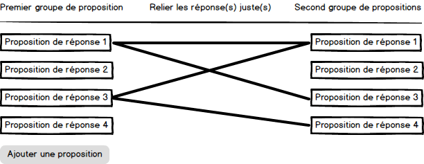
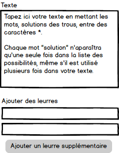
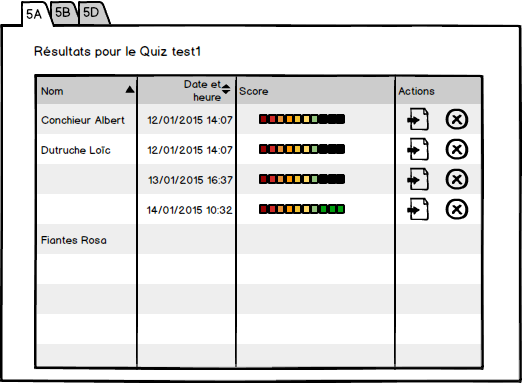

# Module de Quiz / Laclasse.com /V3.
# Spécifications fonctionnelles

## Introduction
Le module de quizs en ligne est un composant de l'ancienne version de laclasse.com. Il doit être ré-écrit pour la version 3.
Ce module comporte 3 points d'entrées : 

- L'exécution des quizs
- La création/modification (back-office)
- L'examen des sessions et résultats des élèves.

Il sera ré-écrit quasiment à iso-fonctionnalité de la version existante, en ajoutant toutefois la prise en charge des contenus multimédia (Audio, Images, Vidéos) dans les questions, les éléments de réponse et les commentaires de corrections.

Les des questions sont au nombre de 3 : 

- QCM / QCU
- Appariement ou Association
- Textes à trous

L'application sera faite au maximum en mode "Single Page App" en utilisant les fonctionnalités d'Angular JS.
Dans les principes généraux de navigation, il sera demandé de veiller à ce que chaque action de destruction de données soit confirmée par l'utilisateurs.
Elle devra être compatible avec les tablettes (responsive design, ergonomie adaptée pour les boutons et les cases à cocher).

## Exécuter/Jouer un Quiz
Il s'agit de l'interface de visualisation ou de rendu d'un Quiz, qui permet de l'exécuter.

### IHM
	
### Gestion des sessions
Une session représente le fait qu'un utilisateur est en train d'exécuter le quiz. Elle démarre au lancement du quiz et se termine lorsque l'utilisateur le quitte, qu'il soit arrivé à la fin ou pas.

Seules les sessions des élèves sont conservées et peuvent être consulter par le profs qui leur a publié, il n'est pas forcé d'être l'auteur du quiz.

Les sessions des autres utilisateurs que les élèves sont détruites un fois terminées.

## Créer / Modifier un quiz
Le quiz est un type de document particulier succeptible d'être manipulé dans l'application de gestion documentaire de l'ENT.
Cela permet de le partager facilement.

### Paramètres généraux
Les paramètres suivants seront définit et accessibles en modification au début du processus de création d'un quiz
Tous ces paramètres prennent les valeurs O/N.

- _mélange des questions_
Si activé, permet de mélanger aléatoirement l'ordre des questions du quiz. Ce calcul est alors effectué à l'initialisation de la session.

- _affichage du score_
Si activé, le score de la question qui vient d'être terminée est affiché sur l'écran de correction (si elle n'est pas masquée *et* qu'on l'affiche après chaque question).

- _refaire le quiz plusieurs fois_
Si activé, l'utilisateur peut revenir sur les questions précédentes et modifier ses réponses.
Sinon, il n'a pas la possibilité de revenir à la question précédente (au passage, il ne faut pas qu'il puisse le faire par les fonctions du navigateur ! ).

- _Masquer la correction_
	- oui : La corrections n'est jamais affichée.
	- non : Possibilité de choisir l'intégration des écrans présentant la correction
		- _Correction après chaque question_
		- _Correction à la fin de l'exercice_

Tous ces paramètres pourrons être initialisés, soit un par un, soit par un mode d'exécution qui contraint les valeurs de plusieurs paramètres à la fois.

Les modes d'exécution du quiz à sa création sont au nombre de 3 :

| Mode         | Melanger | Refaire | Afficher score | afficher correction | corr. à la fin |
| ------------ | -------- | ------- | -------------- | ------------------- | -------------- |
| Entrainement | N | Y | Y | Y | N |
| Exercice     | Y | N | Y | Y | Y |
| Validation   | Y | N | N | N | N |

### Choix du type de question
#### Données communes à tous les types de questions.
- Le libellé
- La question
- L'aide
- Le commentaire de correction
- 
### Les QCM / QCU
C'est une question à choix multiples ou choix unique. Le rendu est le même pour ces deux catégories de questions.
Le fomrulaire de création est donc identique.
Par défaut, 4 propositions sont disponibles d'emblée à la saisie, mais il est possible d'en ajouter des supplémentaires avec un bouton prévu à cet effet.


form-QCM.png

### Les appariements ou associations
Il s'agit d'un mode de questions permettant d'associer plusieurs propositions d'un premier groupe à plusieurs proposition d'un second.
A l'instar du QCM, l'interface de création propose 4 emplacements pour chaque groupe de propositions. un bouton permet d'ajouter des propositions supplémentaires.


form-appariements.png
[a relative link to image](form-appariements.png)

### Les textes à trous
Ce sont des textes dans lequels certains mots doivent être complétés par l'élèves. Ces mots sont fournis par une liste fermée pouvant comporter des leurres, c'est-à-dire des réponses fausses.
La liste fermée seprésente sous forme d'une selectbox constituée de la liste dédoublonnée de tous les mots manquants du textes à laquelle s'ajoute la liste des leurres. Cette liste est ensuite triée par ordre alphabétique.


form-TAT.png.png

## Examiner les sessions
L'examen des sessions permet au prof de voir la progression de ses élèves sur les quizs qu'ils leur a publiés.
L'écran d'examen des sessions est une liste classée par ordre alphabétique de toutes les sessions regroupées par élève, liées à un quiz dans une classe.
Les paramètres d'entrée est donc l'identifiant du quiz, et celui de le classe.
Depuis cette IHM il doit être possible d'accéder au détail des réponses de chaque session de quiz d'un élève.

### Liste des sessions
La liste affiche les attributs suivants :

- nom et prénom de l'élève
- date et heure de la session
- score obtenu 
- lien vers le détail de ses réponses 
- lien vers un traitement de suppression 



## Calcul et gestion des scores
Le score est un taux de réussite. Il borné et peut aller de 0 à 100%.

Afin de ne pas encourager la triche (!) il n'est pas possible d'obtenir le score maximum si l'on coche toutes les réponses à une question. Le calcul du score se fait donc en pondérant le nombre de réponses faites justes et fausses par rapport au nombre de réponses attendues.

### Pour une question
La règle de calcul s'appliquant est donc la suivante : 
```
                          ( nb de réponses justes - ( nb de réponses fausses ) / 2 ) 
Score pour la question =  -----------------------------------------------------------
                                nb de bonnes réponses attendues pour la question
```
On voit ici qu plus il y a de réponses fausses plus le score est bas, s'il est négatif, il est ajusté à 0.

### Pour le quiz
Le score global est la somme des scores de chaque question au prorata du nombre de questions, sans coéfficient particulier.

### Affichage
L'affichage se fait donc sous forme d'une jauge variant entre 0 et 100%.
L'arrondi est à l'unité. Pas de virgule.

## Intégration à la gestion documentaire
La manipulation des quizs se fera via la gestion documentaire. Le quiz doit être considéré comme un document particulier entrant dans le workflow de la GED.
Cette intégration facilite le partage de ces documents, ainsi que la gestion de ses droits, puisque ce sont ni plus ni moins ceux de la GED.

### Créer un quiz
Il doit être possible à travers la GED de créer un nouveau document quiz. Ce document prend l'extension *.quiz* et a une vignette de présentation particulière.
Cette implémentation est déjà en place dans la version actuelle de la GED.

### Editer un quiz
Un clic droit sur le document *.quiz* (ou un clic dans le menu après séelction d'un document de *.quiz*), ouvre une nouvelle fenêtre permettant d'éditer le quiz back-office de création/modification.
Cette implémentation est déjà en place dans la version actuelle de la GED.

### publier un quiz
L'action de publication est simplement le fait de glisser/déplacer ou copier/coller le document *.quiz* dans un espace partagé. 
Cette implémentation fonctionne déjàpour tous les types de documents gérés par la version actuelle de la GED.

### Examiner les sessions
L'examen des sessions sera accessible depuis le menu contextuel (clic droit sur le document de type *.quiz*) ou depluis le menu de l'application GED. 

### Récupérer/copier un Quiz
Il est intéressant de pouvoir duppliquer un quiz issu d'un espace partagé pour le modifier et l'adapater à ses élèves sans que cela n'affecte le quiz source. Cela permet d'amender le-dit quiz sans pour antant changer le quiz source partagé, sur lequel il peut y avoir des sessions en cours ou terminées.
Une option du menu contexuel de la GED, associé au document, ainsi q'une option dans la barrede  menu de l'outil GED, devront permettre cela. 
Lorsqu'elle est utilisé, cette option crée une copie du quiz en affectant l'utilisateur en cours de manipulation comme auteur de ce nouveau quiz. 

## Cadre technique

### Développements

#### Serveur

  - Sinatra
  - Ruby

#### Backend

  - Mysql

#### Client

  - Angular JS

## Reprise de données
Il faudra re-importer les données des quizs dans la nouvelle structure de base de données. L'extraction des données de l'ancienne base est _à la charge d'ERASME_, elle sera faite au format qui convient le mieux pour permettre une intégration facile dans la nouvelle structure de base de données (JSON ? Insert SQL ?).

## Résumé des règles fonctionnelles importantes

1. Il y a 3 types de questions QCM/QCU, Appariement, Textes à trous
2. Tout utilisateur peut avoir une session de quiz.
3. Seules les sessions des élèves sont conservées.
4. Les sessions des élèves sur un quiz donné sont consultables/gérables par le prof qui leur a publié.
5. Il est possible de détruire une session de Quiz pour le prof qui a publier le quiz.
6. Le mélange des questions est effectué à l'initialisation de la session.
7. Le score la question est affiché sur l'écran de correction si celle-ci n'est pas masquée *&* qu'elle intervvient après chaque question.
8. On peut revenir en arrière sur le quiz *que* si son paramétrage nous l'autorise.
9. Le score est un pourcentage sous forme d'entier.
10. Score pour la question = ( nb de réponses justes - ( nb de réponses fausses ) / 2 ) / nb de bonnes réponses attendues pour la question;
11. Le score global est la somme des scores de chaque question au prorata du nombre de questions, sans coéfficient particulier.


